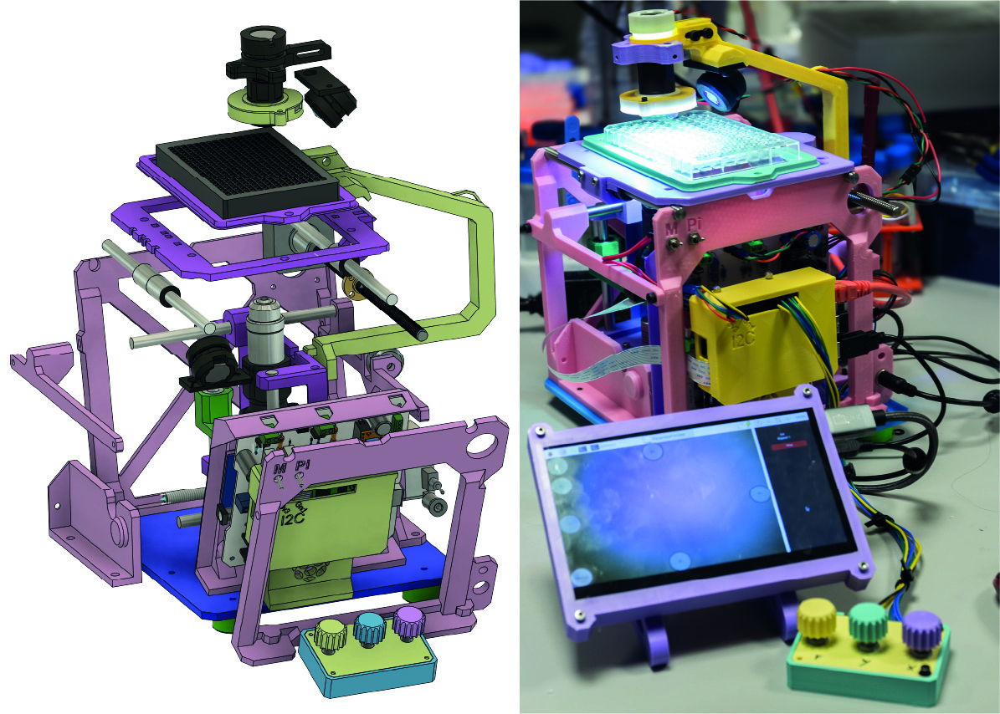

# An open-sourced 3D printable microscope with a large CNC stage

[bioRxiv.org](https://www.biorxiv.org/content/10.1101/2024.12.31.630915v1)

Welcome to the repository for an affordable, high-performance, open-source microscope. Designed with researchers in mind, this versatile platform supports brightfield, fluorescence imaging, and high-throughput scanning of standard microtiter plates. It is fully 3D-printable, easy to assemble, and built for customization. Explore the project to access design files, firmware, and software, and join the growing community of users advancing accessible microscopy.

## Navigation

[Building Instruction](hardware/readme.md)

[Bill of materials](hardware/)

[3D printable Files](hardware/print_files/readme.md)

[Samples images and video](samples)

[Arduino firmware](firmware/readme.md)

[Python sources](modules/readme.md)

