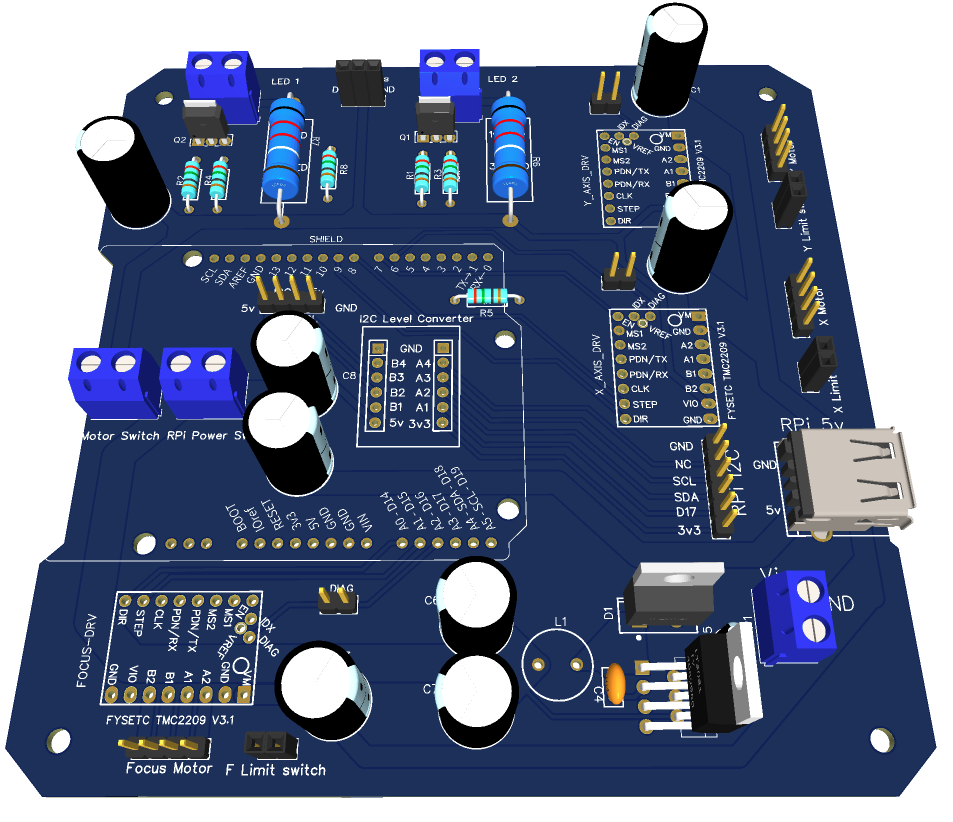

# Electronic mainboard

The electronic main board mostly serves as an interconnect for off-the-shelf modules Power and control for the motors are managed by Trinamic TMC2209 stepper drivers in a StepStick-compatible format. While it is technically possible to use different drivers, the firmware employs the StallGuard4 feature of the Trinamic drivers for homing the axes. If a different driver is used, end-stop switches will need to be added, and the firmware reconfigured accordingly (not recomeended to try)

the gerber zip file contain all that is needed to order the PCB from a manufacturer such as JLCPCB. It is a 2 layer board with 1 oz/sq ft copper.

This version use an integrated 5V regulator, a version with an external 5V 5A regulator is being tested for easier assembly and component sourcing.

