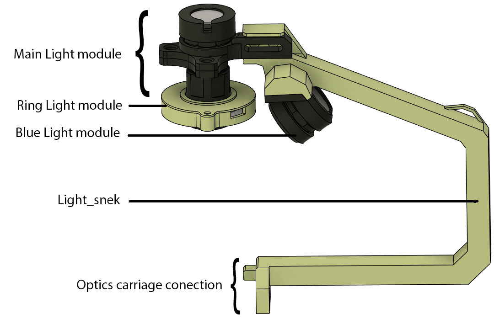

# Illumination system
The top illumination system is all attached to the light_snek , this part can be printed with large layer hight for speed (0.2mm), it is a structural part that should not flexed, therefore it should have >3 walls, and printed with >25% infill.

All the other parts contain threads, and like the optical stack, shopuld be printed with thin layers (<0.1mm), and highest possible quality setting.

