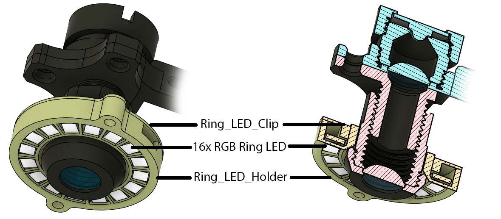
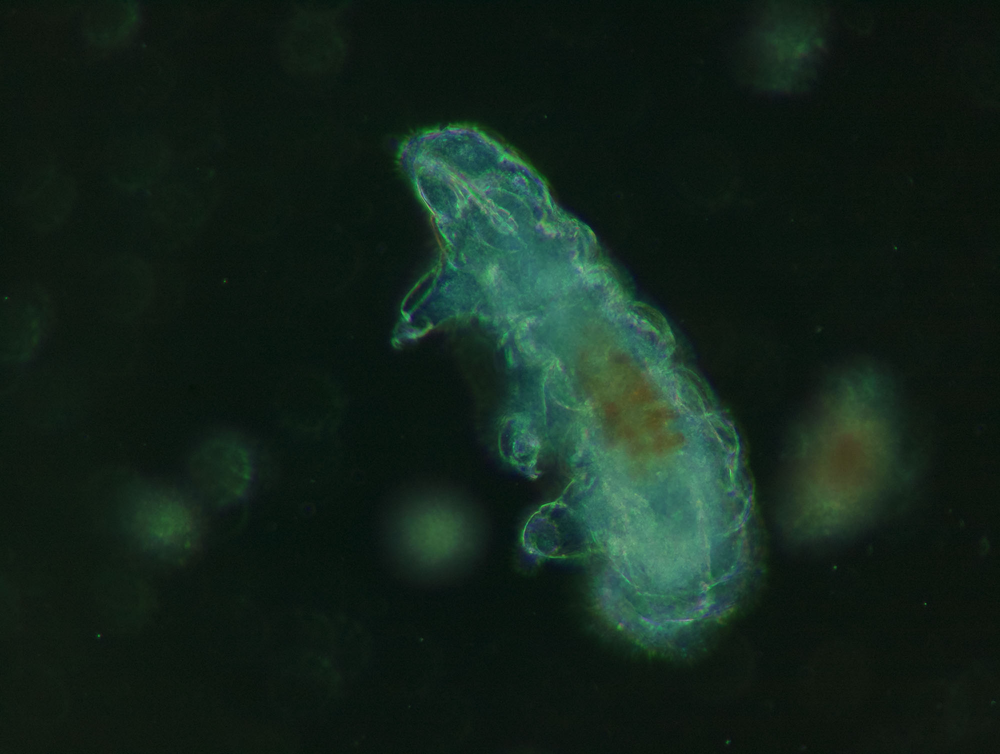
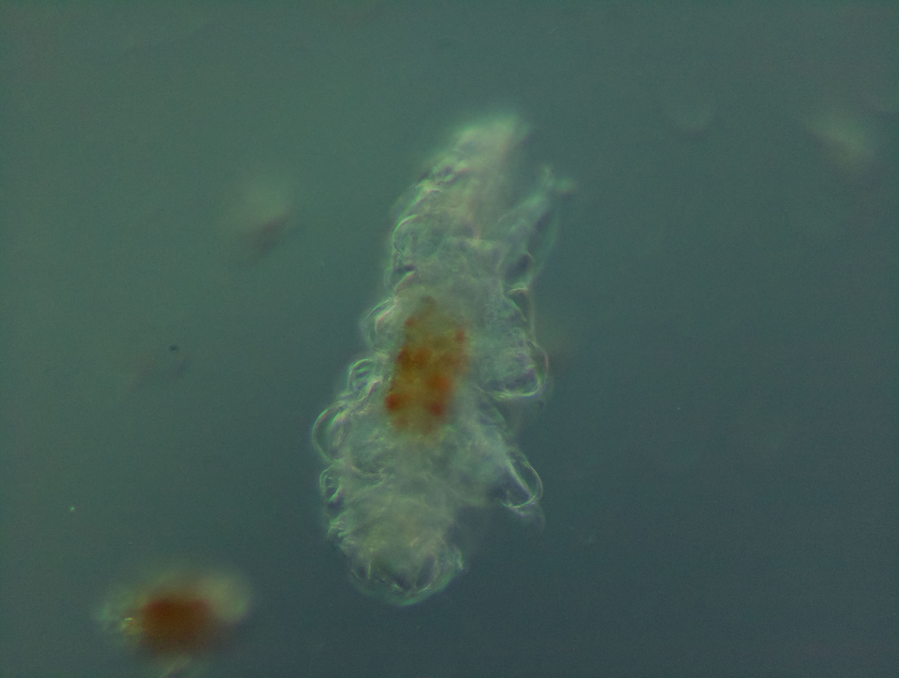

# Ring Light module

This module allow for darkfield and oblique illumination.
It is supported by the condenser tube and so cannot be installed without it.

Example of tardigrade with darkfield illumination :

Example of tardigrade with oblique illumination and magic tape for diffusion ([Kristiansen-illumination](https://fr.scribd.com/document/645579945/Kristiansen-illuminationhttps:/), sometimes called pseudo differential interference contrast)
