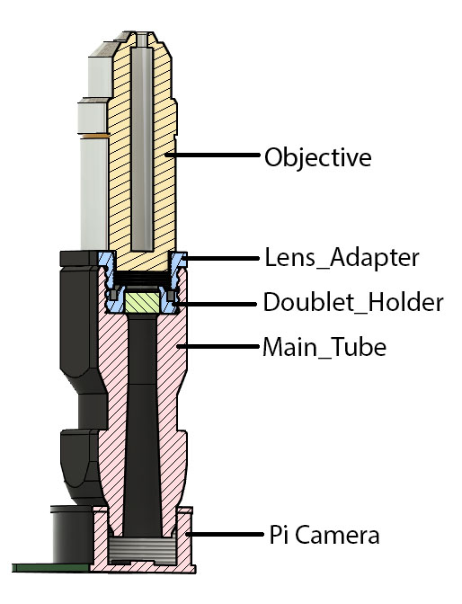
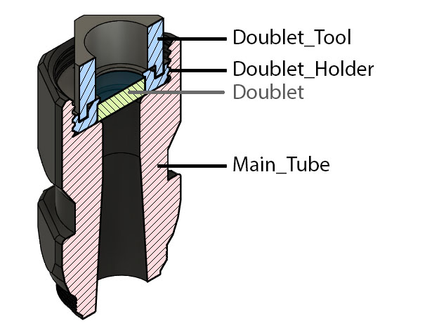
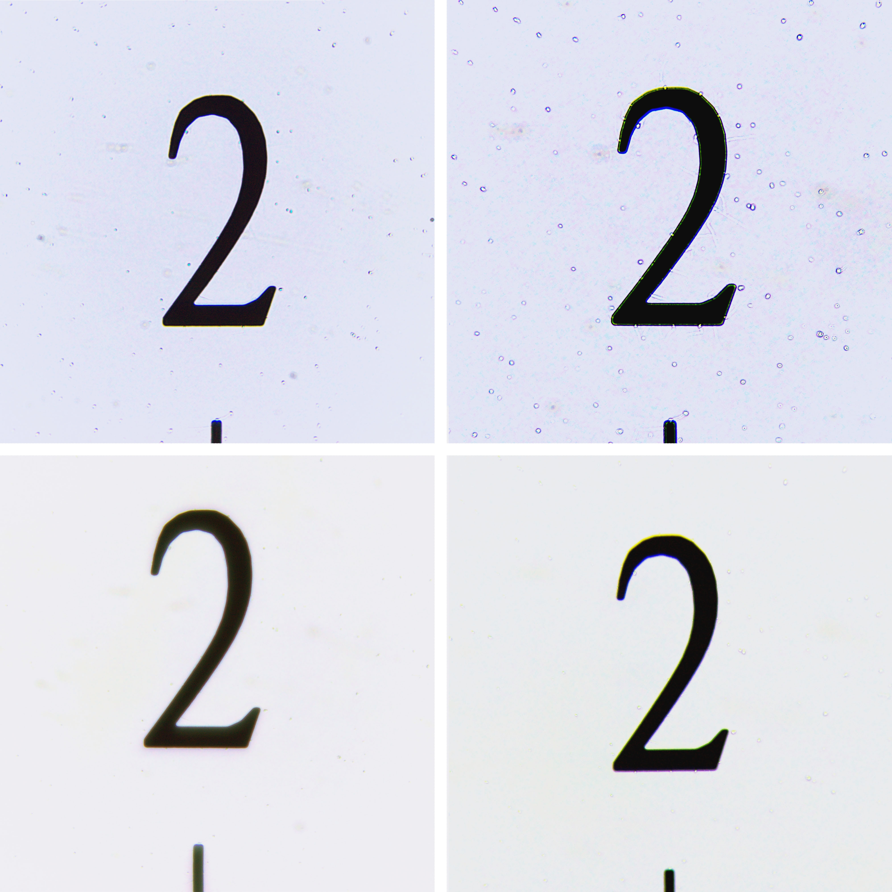

# Optical Stack

Files for the optical stack, theses parts have threads and should therfore be **printed with thin layer (<0.1mm)** with the highest quality settings.

Scarf seams if present in your slicer will improve the thread quality.

The main tube thread directly on the PiCamera C mount, this is metal on plastic and might need a litle bit of force.

Every lenses should have its own lens adapter printed so the very thin metal R.M.S. mount of the lens is threaded only once on plastic. Then the plastic/plastic of lens adapter and main tube can be attached and detached very easyly with no domage to the threads.

The doublet tool is there to help threading the doublet holder (containing the doulbet) to the main tube:

Comparison of image qualityobtained using a 40X objective lens with and without the f50 doublet in the tube lens. Without condenser light (usually for lowmagnification work) the extra lens is not necessary. A substantial improvement in image quality is achieved when using the condenser (bottom right).

