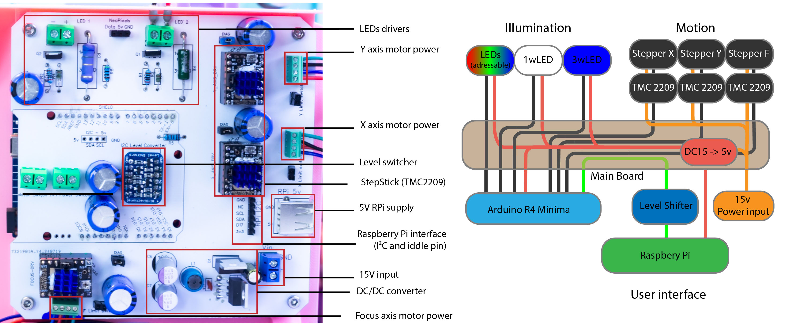
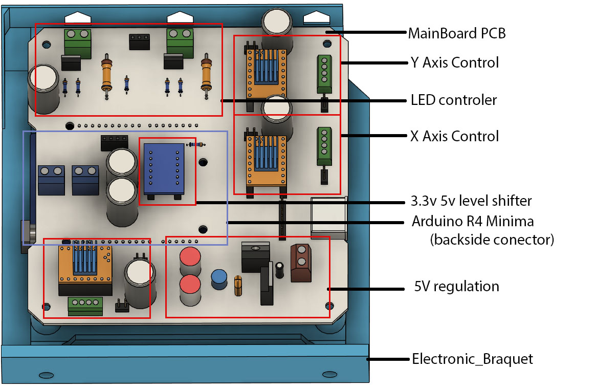
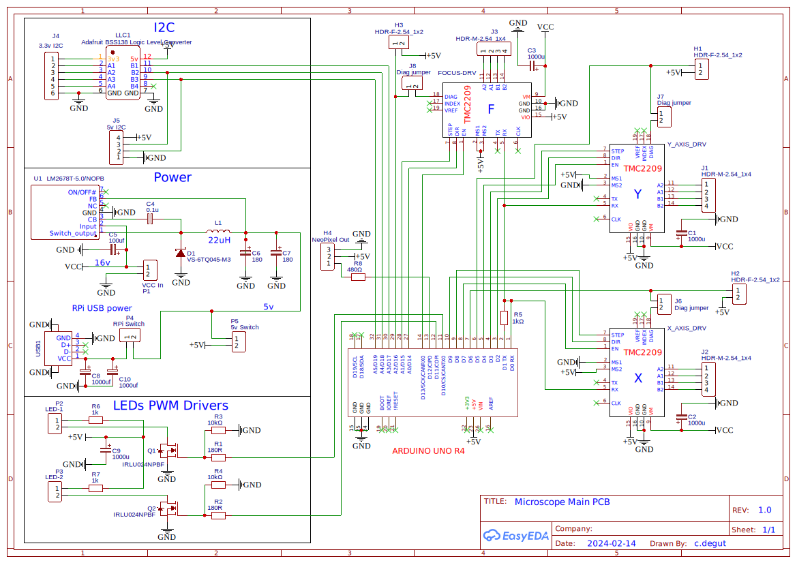
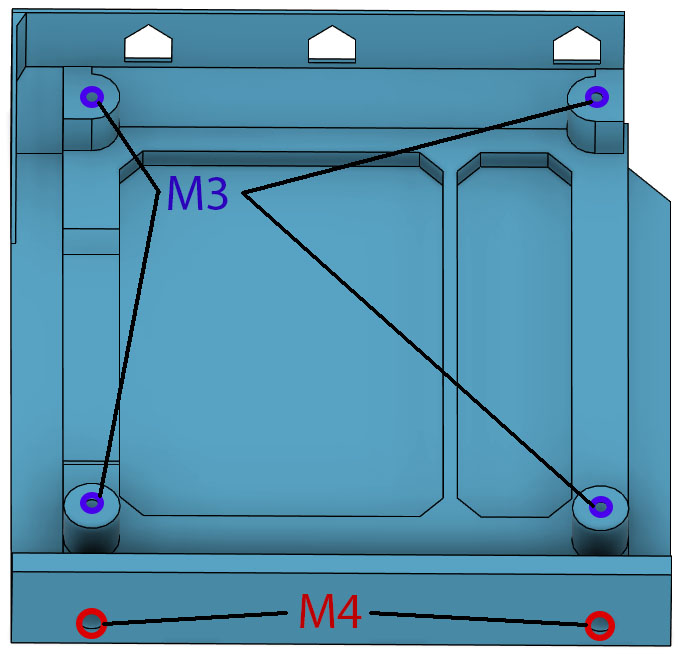
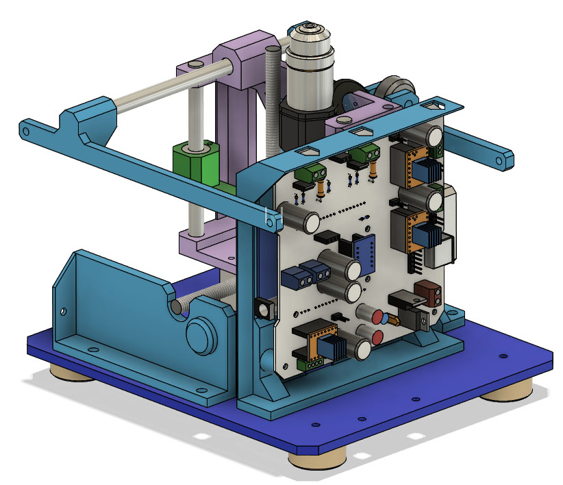

# Electronic mainboard

The electronic main board mostly serves as an interconnect for off-the-shelf modules Power and control for the motors are managed by Trinamic TMC2209 stepper drivers in a StepStick-compatible format. While it is technically possible to use different drivers, the firmware employs the StallGuard4 feature of the Trinamic drivers for homing the axes. If a different driver is used, end-stop switches will need to be added, and the firmware reconfigured accordingly (not recomeended to try)

the gerber zip file contain all that is needed to order the PCB from a manufacturer such as JLCPCB. It is a 2 layer board with 1 oz/sq ft copper.

This version use an integrated 5V regulator, a version with an external 5V 5A regulator is being tested for easier assembly and component sourcing.

Photograph of the populated custom PCB and schematic of the interconnections. Red shows power line, black shows transistor to transistor logic (TTL), and green shows the I2C link.

The main printed part for the electronic is the electronic bracket that serve as a mount for all the electronic.

3D render of the PCB

PCB Schematics

## Heat set inserts

The bracket requires:

* 2 - M4 ø 6 mm OD heat set insert
* 4 - M3 ø 5 mm OD heat set insert

## In Assembly context

