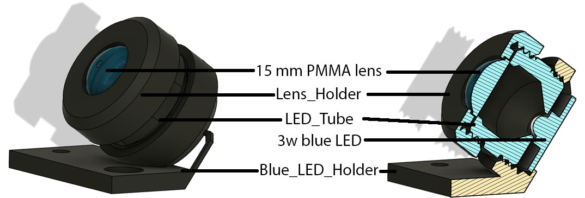

# 3w Blue LED module

This module can be mounted either on the light snek as top off axis illumination, or on the optical carriage as bottom off axis illumination.

These par comport threads, and therfore should be printed with very small layer high (<0.1mm) and highest qualiy setting.
When using a high power 3w LED, the temperature of the heat sink can get to 80 °C, if the part is printed in PLA, you should consider activating the heat protection in the firmware (20s off timer on the blue LED), but we recomend if possible to print the parts in more heat resistant material such as PETG or PC.

