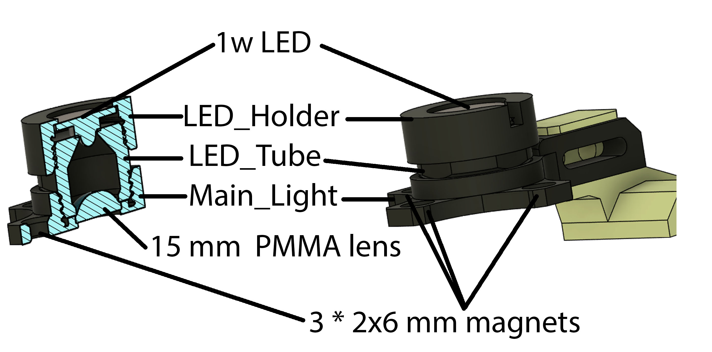
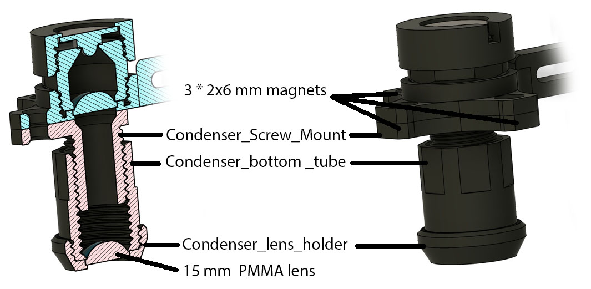
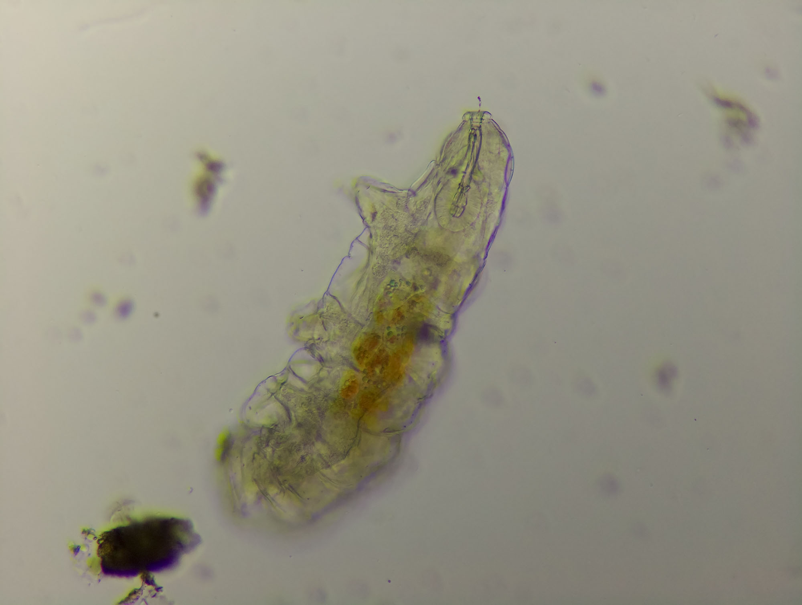

# Main Light Module

This is a 2 components system, the main LED holder, and the magnetically attached condenser.
All should be printed with thin layers (<0.1mm), and highest possible quality setting. Scarf seams if present in your slicer will improve the thread quality.

## Main LED module

If not using the condenser at all, the 15mm PMMA can be  omited as well as the magnets

Example image of a tardigrade with the simple illumination:

## The condenser

This is a magnetically attached and detachable module, the screw axis allow to focus the condenser on the sample.

Example image of a tardigrade with the condenser illumination:

