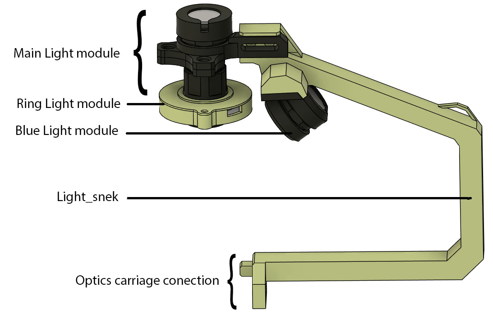

# Illumination system

The top illumination system is all attached to the light_snek , this part can be printed with large layer hight for speed (0.2mm), it is a structural part that should not flexed, therefore it should have >3 walls, and printed with >25% infill.

All the other parts contain threads, and like the optical stack, shopuld be printed with thin layers (<0.1mm), and highest possible quality setting.

## Light Snek

The light snek is the large arm that connect the illumination system to the [optics carriage](../mecanical_stage/Focus_axis/readme.md).

## Illumination component

* [Main light Module](./main_light_module/readme.md)

* [Ring light Module](./ring_light_module/readme.md)

* [Blue light Module](./blue_light_module/readme.md)
