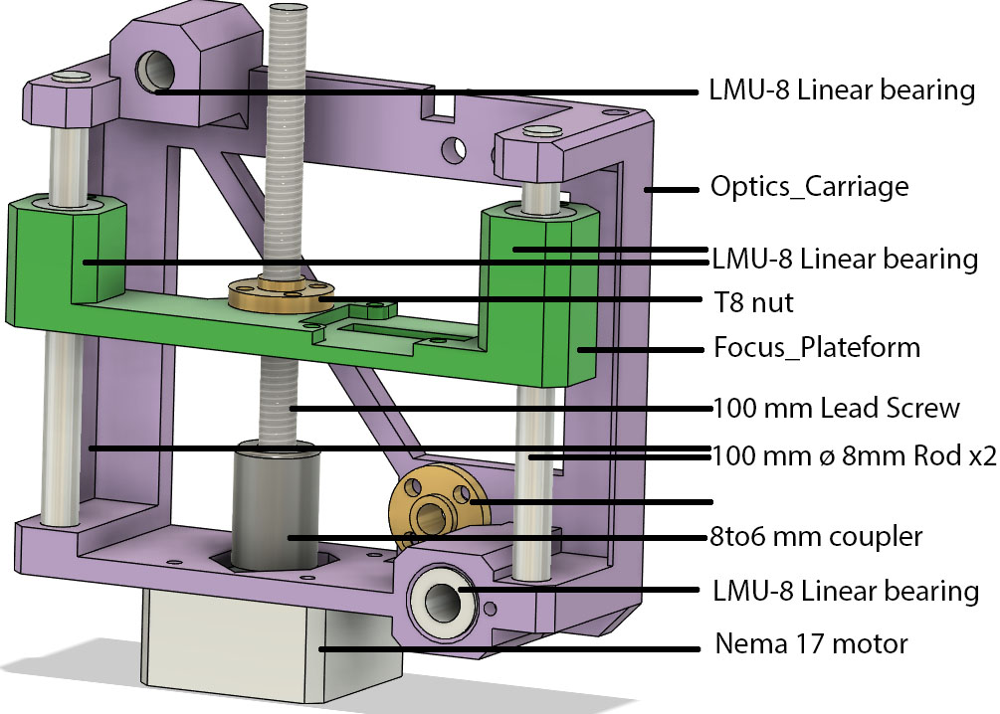

# The focus carriage and axis

These parts are mounted on the X axis, and carry the optical stack

## General

## Bill of materials

* 2 - 100 mm ø 8 mm linear rods
* 1 - 100 mm ø 8 mm 2 mm pitch trapezoidal lead screw and nut
* 1 - 6 mm to 8 mm flexible shaft coupler
* 1 - Pancake NEMA 17 stepper motor
* 4 - LMU-8 8mm linear bearings

## Heat set inserts

* 3 - M4 ø 6 mm OD heat set insert
* 4 - M2 ø 4 mm OD heat set insert
Add the heat set insert:

## In Assembly context

Assemble all part and fit the [optical stack](../../optical_stack/readme.md):

Then fit on the X axis:

