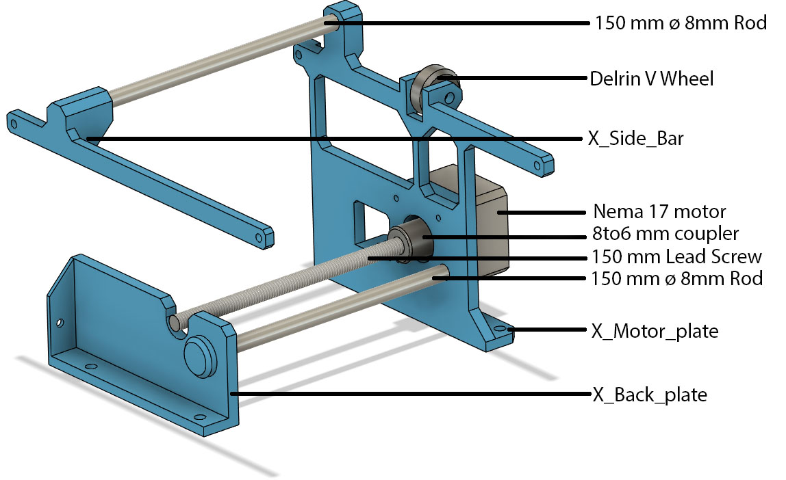
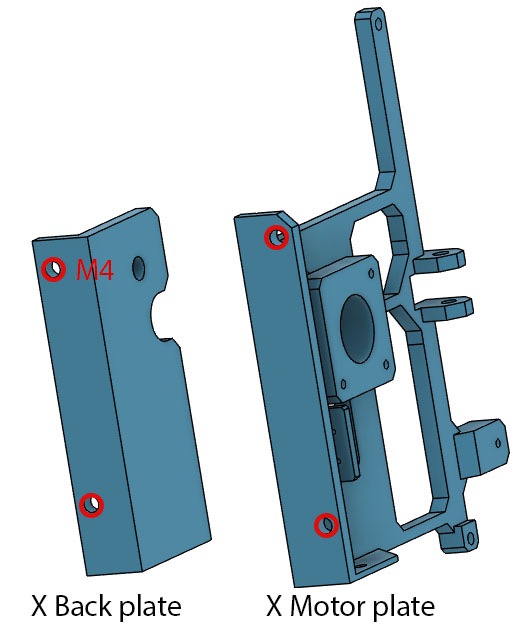
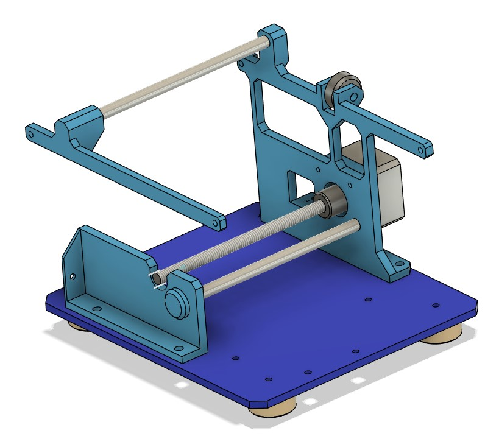

# The X axis

The X axis is the second element to be built after the base plate.

This axis hold the focus axis that will need to be built next.
It have 3 main printed parts, the back plate, the motor plate and and a side bar.
Like all axis, the non printed part are 2 8 mm linear rods, a trapezoid lead screw and a Nema 17 motor

* 2 - 150 mm ø 8 mm linear rods
* 1 - 150 mm ø 8 mm 2 mm pitch trapezoidal lead screw and nut
* 1 - 6 mm to 8 mm flexible shaft coupler
* 1 - Pancake NEMA 17 stepper motor
* 1 - Delrin V Wheel held by a M5 screw
* 4 - M4 ø 6 mm OD heat set insert

The 4 insert are for M4 screw to fix to the base plate:

