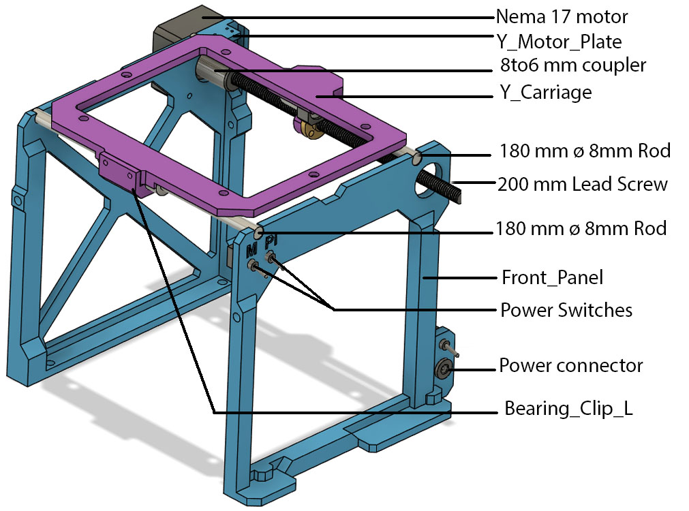
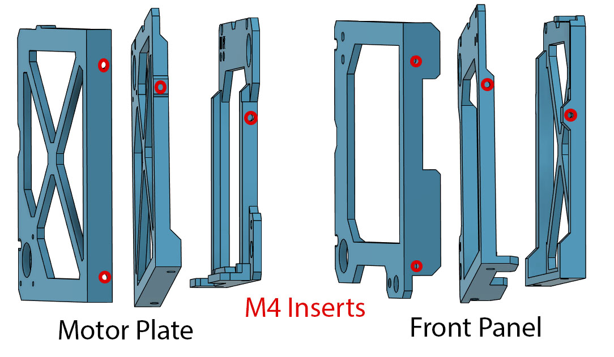
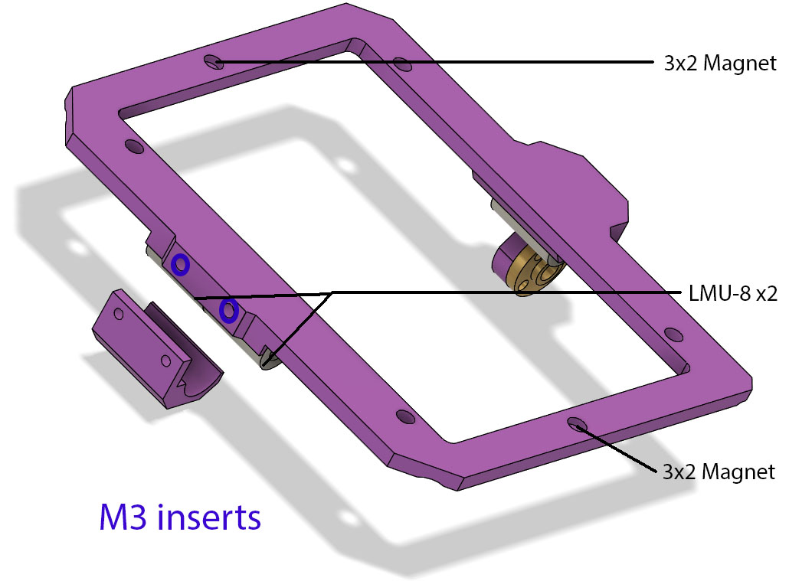
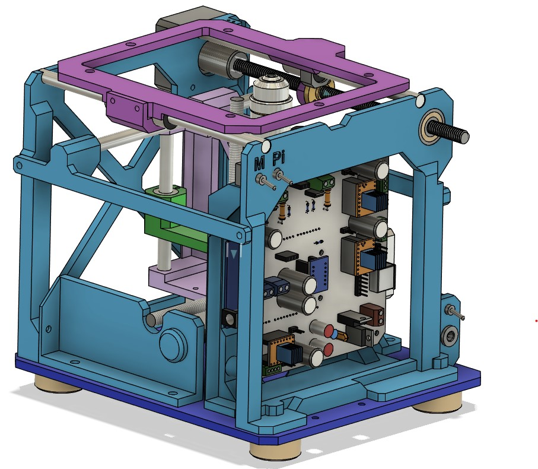

# The Y axis

The Y axis support and move the sample perpendicularly to the X axis.
It have 3 main printed parts, the back motor plate, the front panel and and a Y carriage.
Like all axis, the non printed part are 2 8 mm linear rods, a trapezoid lead screw and a NEMA 17 motor.
For increased stability the carriage use 3 LMU-8 linear bearings

## Heat set insert

There is 4 M4  insert per panels

2 M3 inserts on the Y carriage to fit the bearing clip

## Bill of materials

* 2 - 180 mm ø 8 mm linear rods
* 3 - LMU-8 Linear bearings
* 1 - 200 mm ø 8 mm 2 mm pitch trapezoidal lead screw and nut
* 1 - 6 mm to 8 mm flexible shaft coupler
* 1 - Pancake NEMA 17 stepper motor
* 8 - M4 ø 6 mm OD heat set inserts
* 2 - M3 ø 4 mm OD heat set inserts

## In Assembly context

