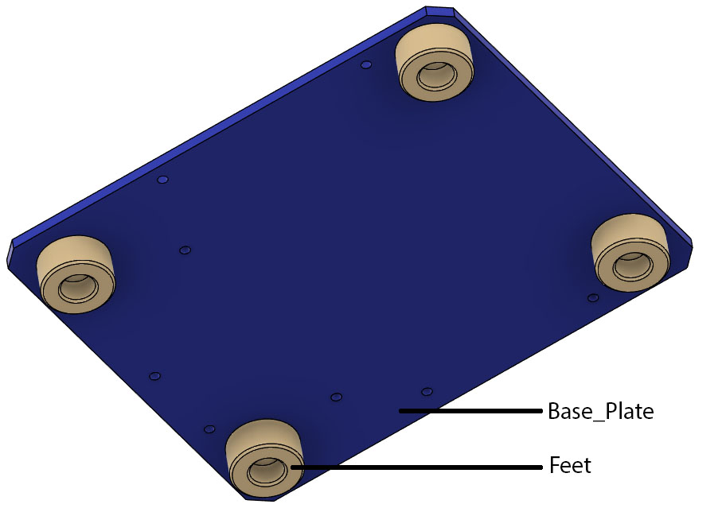

# Base Plate and Feets

The base plate is designed to bu laser cut from 5 mm acrylic, but can also be 3D printed in standard PLA. It is provided as both DXF file and 3mf.

The feet can be printed in PLA, but printing in TPU will greatly improve stage stability.

