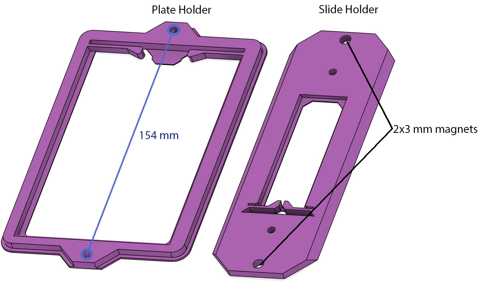

# Sample Holders

The microscope sample holders are attached to the stage withy two magnets 3x2
2 sample holders are provided:

* slide holder
* standard plate holder

Both have compliant mechanism to help lock the sample in place.

It is very simple to design your own sample holder for any shape sample, the only requirement is to have the two magnets holes 154 mm apart.
