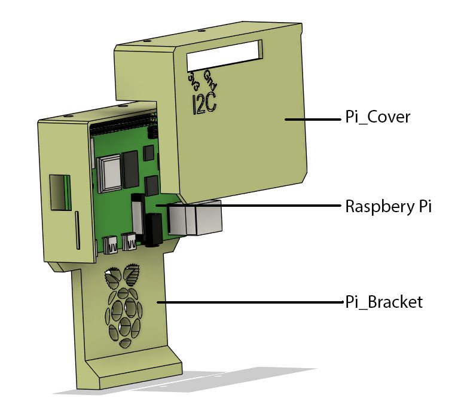
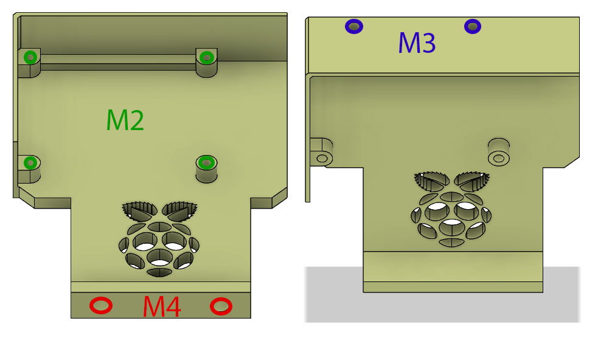
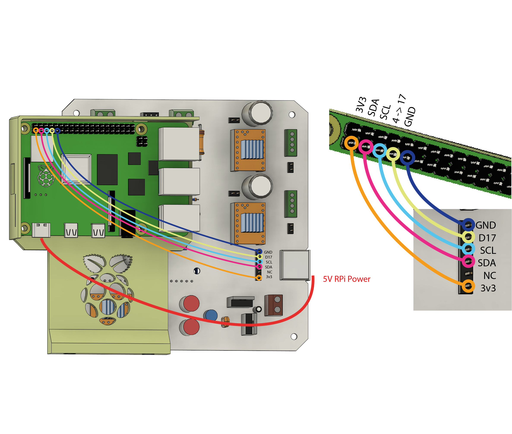
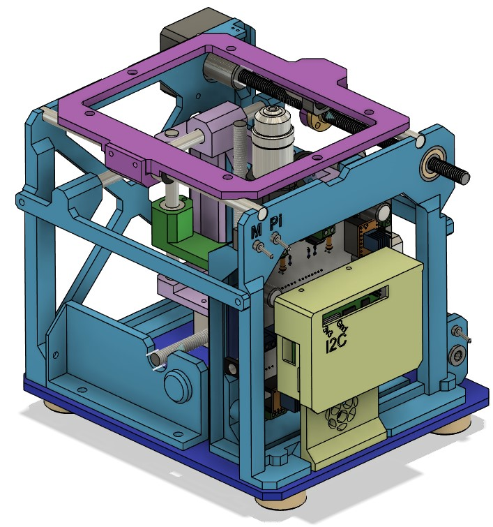

# The RaspberryPi

## Software configuration

[Raspberry Pi Software Configuration](RaspberryPi_config.md)

## Pi Bracket

A pi bracket and cover need to be printed.

## Heat set inserts

This bracket use many inserts:

* 2 - M4 ø 6 mm OD heat set insert
* 2 - M3 ø 4 mm OD heat set insert
* 4 - M2 ø 4 mm OD heat set insert

## I2C Connection

The I2C connection use 5 Female-Female Dupont style jumper wire. These can be bought either pre-made, or DIY with thin (26AWG) wire, and dupont crimping tool and connectors.

## In Assembly context

